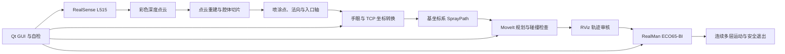

# 基于三维视觉与六轴机械臂的腔体等离子自动喷涂系统

> 用途：研究生求职简历、项目介绍和技术面试准备。
>
> 项目周期请按个人实际情况填写。仓库中的机械臂运动流程 V1 于 2026 年 7 月完成现场验收。

## 一、简历精简版

**项目名称：基于三维视觉与六轴机械臂的腔体等离子自动喷涂系统**  
**项目角色：项目负责人 / 核心开发者（独立负责系统架构、算法实现与整机联调）**  
**技术栈：C++、ROS 2 Galactic、MoveIt、Qt 6、Eigen、PCL、VTK、Open3D、RealSense SDK、RealMan ECO65-BI、Jetson、URDF/Xacro、RViz、CMake/colcon**

- 独立设计并实现面向狭窄腔体的自动喷涂系统，打通 RealSense L515 点云采集、三维重建与切片路径、手眼坐标转换、TCP 位姿生成、MoveIt 规划、RViz 审核和 RealMan ECO65-BI 实机执行链路。
- 使用 ROS 2 C++ 独立开发相机路径到机械臂基坐标系的转换节点，显式管理 `camera -> Link6 -> baselink` 坐标链、采集时六轴关节快照、侧喷口 TCP 和标定许可，支持数百个位姿的批量转换与有效性检查。
- 设计“当前位置 -> 预入口 -> 法向进入 -> 连续多层喷涂 -> 零度停车 -> 沿轴退出”的运动状态机，分离腔外移动速度与腔内喷涂速度，并支持腔内任意时刻急停、停稳检测和从实际停车位姿安全退出。
- 独立定位并解决关节状态冷启动、0/360 度边界跳变、分段轨迹时间戳重复、IK 分支切换和旧轨迹复用等问题，增加实时状态门控、轨迹去重与重新时间参数化、起点一致性校验、碰撞检查和轨迹时效检查。
- 搭建手眼标定、深度对齐和末端 TCP 的离线验证工具及数据记录流程；稳定数据段使用 58 组样本完成重估，固定板平移中位误差为 2.541 mm，主算法间最大差异为 0.368 mm / 0.352 deg。
- 主导现场实机联调并完成等离子关闭条件下的全流程验收：机械臂连续执行全部喷涂层，末层回到 0 度后不在腔内额外旋转，沿入口法向退出并到达预入口；路径执行、坐标转换和标定工具共保留 65 项 C++ 测试。

**个人职责范围：** 独立完成项目需求分析、软硬件方案选型、ROS 2 系统架构、相机与点云链路、手眼标定分析、末端/TCP 建模、坐标转换、MoveIt 运动规划、安全状态机、Qt GUI 集成、自动化测试、现场故障定位和真实机械臂验收；对项目第一版从视觉采集到机械臂安全退出的完整技术链路负责。

## 二、项目背景

传统腔体喷涂依赖人工观察和手动控制，难以同时保证入口对准、喷涂距离、姿态连续性和狭窄空间内的运动安全。本项目在 Jetson 平台上开发一套集三维视觉、轨迹生成、机械臂规划与设备控制于一体的桌面软件：通过 RealSense L515 获取带颜色深度点云，重建目标腔体并生成分层喷涂位姿，再将视觉坐标系中的轨迹转换到 RealMan ECO65-BI 机械臂基坐标系，由 MoveIt 完成规划、碰撞预检和真实机械臂执行。

第一版目标不是让机械臂从固定示教点机械重复，而是让软件针对每次重新采集的腔体几何自动生成入口和多层喷涂路径，并保证机械臂能够从任意合法当前位置到达预入口、沿入口法向进入、完成全部喷涂运动，最后安全退出。

## 三、系统架构



核心数据链路：

```text
L515 原始深度/彩色流
-> 带颜色 PointCloud2
-> 点云重建、腔体轴线和切片轮廓
-> 分层喷涂点与喷嘴姿态
-> camera_depth_optical_frame
-> camera_color_optical_frame
-> Link6（手眼矩阵）
-> baselink（采集时正运动学）
-> 侧喷口 TCP 位姿
-> MoveIt 关节轨迹
-> RealMan 控制器
```

## 四、个人独立完成的核心工作

### 1. 机械臂工程结构与 ROS 2 接口设计

- 将项目自有机械臂功能集中到 `src/third_party/plasma_robot/tools`，按 `camera`、`eye_hand`、`tf`、`motion` 和独立末端描述包划分职责，避免直接修改厂家 RealMan ROS 包和 RealSense 官方包。
- 设计 `SprayPath`、路径转换状态、入口运动状态和执行状态等 ROS 2 消息/服务，使 GUI、视觉路径、坐标转换和运动规划通过明确的数据契约解耦。
- 保留厂家驱动作为底层通信层，在项目侧增加校验、规划和安全状态机，降低后续升级厂家包时的维护成本。

### 2. 彩色点云采集与相机链路稳定性

- 接入 Intel RealSense L515 的深度、彩色、内参和深度到彩色外参话题，为点云重建提供统一的 `PointCloud2` 输入。
- 在不修改厂商包的前提下实现 C++ 彩色点云桥：保留深度点云的 XYZ 几何，根据工厂外参和 RGB 内参投影颜色，输出包含 `x/y/z/rgb` 字段的 `/plasma/camera/colored_points`。
- 使用 `SensorDataQoS` 和限频输出降低约 5 MB 点云帧造成的可靠传输反压，无法投影到彩色视场的点保留为中性灰，避免为显示颜色破坏原始几何。
- 通过 USB 枚举、`/dev/video*`、原始彩色/深度话题和点云话题分层诊断相机卡顿，区分 GUI 渲染、ROS 桥接和 USB 设备掉线问题，避免无依据地修改已经调好的相机参数。

### 3. 手眼标定与坐标转换

- 明确手眼矩阵约定为 `gripper_T_camera`（`^Link6 T_camera`，单位为米），结合采集时六轴关节快照计算相机路径到 `baselink` 的转换，避免使用执行时机械臂姿态污染离线视觉轨迹。
- 开发 ROS 2 C++ 路径转换节点，处理相机深度/彩色光学坐标系 TF、手眼矩阵、Link6 正运动学、工具轴和侧喷口 TCP 偏置，并将转换质量、标定版本和许可状态写入路径元数据。
- 对重新安装相机后的 62 组数据进行一致性分析，识别第 59 组起约 36.58 至 47.94 mm 的固定板关系突变，只保留前 58 组稳定样本重估，避免异常安装状态混入最终矩阵。
- 建立留一法、五折验证和 TSAI/PARK/HORAUD 多算法一致性对比。稳定段结果达到固定板平移中位/最大 2.541/6.915 mm，留一法最大影响 1.432 mm，主算法间最大差异 0.368 mm / 0.352 deg。
- 实现基于 Huber 损失和 LM 优化的鲁棒 SE(3) 离线分析工具，同时估计手眼变换与固定标定板位姿；对高影响样本进行剔除评估，将另一批数据的固定板平移中位误差由 3.035 mm 降至 1.836 mm。
- 保留“候选、用户批准暂用、严格验收通过”三个层级，标定质量不达门限时仍可进行离线预览，但默认不开放生产运动许可。

### 4. 等离子末端 URDF、TCP 与入口几何

- 根据实物装配和 CAD/STL 建立 ECO65 机械臂加等离子末端的 URDF/Xacro 与 SRDF 模型，支持不同转接件、喷杆长度和喷口规格的组合管理。
- 将“圆头末端”和“实际侧喷口 TCP”分开建模。当前 3/4 规格末端中，Link6 法兰到圆头末端为 318 mm，侧喷口 TCP 轴向位置为 310 mm、径向偏置为 2 mm。
- 使用侧喷口中心跟踪喷涂点，圆头只用于入口位置和底面安全间隙检查，解决“工具几何末端”和“实际工艺作用点”混用造成的插入深度错误。
- 将预入口、安全入口、第一喷涂层和腔体轴向补偿分开表达，使入口定位误差、TCP 误差和喷涂层深度误差能够独立测量与修正。

### 5. 自动入口和多层喷涂轨迹规划

- 从视觉路径中提取最外侧开口切片和腔体参考轴，生成物理开口、预入口、安全入口及全部喷涂层位姿。
- 采用“自由空间 MoveIt 规划到预入口 + 沿入口法向进入”的分段策略，避免机械臂先移动到腔体下方再横向靠近而碰撞外壳或周边结构。
- 对每层喷涂路径实现 `0 -> +180 -> 0 -> -180 -> 0` 的姿态序列，并连续执行后续全部层；实际路径曾覆盖 297、446、595 等不同规模的喷嘴位姿集合。
- 为 IK 多解设计最多 8 个完整分支尝试，结合实时起始关节选择连续解，减少 joint6 无意义绕转和机械臂姿态突变。
- 将腔外移动速度和腔内喷涂速度设计为独立参数，支持 GUI 中分档选择，既提高到达入口的效率，又保留腔内低速调试能力。

### 6. MoveIt 轨迹审核与安全控制

- 在真实运动前完成关节范围、非有限值、最大关节步差、路径完整率、IK、环境碰撞、自碰撞、起点一致性和轨迹时效检查；检查失败时保持运动门关闭。
- 直接以 `SensorDataQoS` 订阅约 200 Hz 的 `/joint_states`，使用单调时钟设置 500 ms 新鲜度门限，并从六轴快照显式构造 MoveIt 起始状态，解决冷启动时 `CurrentStateMonitor` 取不到新鲜关节状态的问题。
- 对笛卡尔分段轨迹删除重复相邻关节点，再使用 `IterativeParabolicTimeParameterization` 重新生成速度、加速度和严格递增时间戳，解决分段拼接后时间戳不递增导致的执行拒绝。
- 对 joint6 的 0/360 度表达、IK 支路和绝对步差进行审核，防止规划预览看似连续但真实控制器执行整圈旋转。
- 对审核轨迹增加时效和实时起点复核；机械臂被手动拖动或当前位置变化后，旧轨迹自动失效，防止从错误起点执行。

### 7. 任意停车与安全退出状态机

- 实现腔内红色停止链路，同时关闭等离子控制输出，并请求入口规划器、路径执行器和 RealMan 底层停止。
- 新增“正在腔内停车”和“已在腔内停稳”状态。新鲜控制器状态优先作为停稳依据；当控制器停止后不再刷新可选状态字段时，回退到六轴在 0.05 deg 范围内连续稳定 1 s 的判定。
- 正常完成时保持喷口 0 度，沿腔体轴退出；中途停车时保持实际停车姿态，不先在腔内旋转回零，只从实时 Link6 位姿重新规划到预入口平面。
- 动态退出继续检查轴线偏离、最大外退距离、关节状态新鲜度、IK、碰撞、关节跳变和时间戳；任何检查失败都保持停车，不继续下发运动。

### 8. Qt GUI 与整机联调

- 将机械臂连接检查、路径转换状态、标定许可、MoveIt/RViz 预览、分段确认、速度选择、停止和退出操作融入现有 Qt 6 桌面软件。
- 将机械臂运行信息转换为操作者可理解的状态，例如“等待新轨迹”“已到预入口”“安全入口待确认”“全部层完成”“等待停稳”和“可安全退出”。
- 建立“自检 -> 采集 -> 重建 -> 路径生成 -> 坐标转换 -> 规划审核 -> 实机执行 -> 安全退出”的现场 SOP，并为关键问题保留可复现日志和 Markdown 验收记录。

## 五、关键技术难点与解决方案

### 难点 1：视觉轨迹正确，但机械臂入口和轴向深度存在系统偏差

**问题：** 点云中的喷涂点、物理开口、圆头末端和侧喷口 TCP 含义不同，简单叠加世界坐标补偿会同时破坏入口和喷涂层深度。  
**方案：** 分离手眼变换、工具 TCP、物理开口、预入口、安全入口和喷涂层轴向补偿；通过现场非接触测量判断误差来源，只沿腔体轴施加可追踪补偿，不篡改手眼矩阵。  
**结果：** 入口方向和位置明显改善，并能在不破坏完整流程的前提下独立调整喷涂插入深度。

### 难点 2：MoveIt 冷启动反复报告关节状态不可用

**问题：** 驱动实际以较高频率发布关节状态，但 MoveGroupInterface 内部状态监视器在启动竞争期间无法稳定取得首帧，导致规划被安全锁拒绝。  
**方案：** 独立订阅 `/joint_states`，使用单调时钟检查新鲜度、变量完整性和关节范围，并显式设置规划起始状态。  
**结果：** 冷启动后的首次规划可以直接成功，不再依赖“先失败一次再重试”。

### 难点 3：分层轨迹可预览，但控制器拒绝执行或 joint6 绕圈

**问题：** 分段交界存在重复点、时间戳不严格递增；角度跨越 0/360 度时可能表现为约 359 deg 的伪跳变，IK 也可能切换到另一支路。  
**方案：** 轨迹去重、重新时间参数化、连续角和绝对关节步差审核，并根据实时起始关节选择连续 IK 分支。  
**结果：** 全部喷涂层能够连续运行，最后回到 0 度停车，没有出现此前的无意义整圈旋转。

### 难点 4：按下停止后机械臂已停，但软件一直等待停稳

**问题：** RealMan 控制器停止后不持续刷新 `arm_current_status`，只依赖该字段会导致状态机永久等待。  
**方案：** 保留新鲜控制器状态的最高优先级，同时增加基于六轴连续稳定窗口的回退判定，并继续要求 Link6 位姿和关节消息新鲜。  
**结果：** 支持腔内任意时刻停车，并能从实际停车位姿沿轴直接退出。

### 难点 5：相机节点在线，但 GUI 没有实时彩色点云

**问题：** 故障可能来自 USB 掉线、RealSense 原始流停帧、点云着色桥或 GUI 渲染，单看节点进程无法判断。  
**方案：** 按“USB 枚举 -> 视频设备 -> 原始彩色/深度 -> XYZ 点云 -> 彩色点云 -> GUI”逐层定位；项目侧桥接颜色，不修改厂商包，并区分参数错误和物理 USB 链路错误。  
**结果：** 恢复带颜色点云显示，同时保留官方相机包的可升级性。

## 六、项目成果与验证数据

- 完成视觉路径到真实六轴机械臂的端到端闭环，不依赖固定示教轨迹，可对每次新重建路径重新生成入口和多层喷涂运动。
- 现场完成低速实机全流程干运行：当前位置到预入口、法向进入、连续执行全部喷涂层、末层 0 度停车、直接沿轴退出并验证回到预入口。
- 正常退出过程中没有在腔体内增加旋转；中途停止场景具备从实际停车位姿重新规划退出的能力。
- 支持 297 至 595 个喷嘴位姿规模的路径转换、规划和审核。
- 手眼稳定段使用 58 组有效样本；固定板平移中位误差 2.541 mm，留一法最大影响 1.432 mm，主算法间最大差异 0.368 mm / 0.352 deg。
- 当前测试记录：`plasma_path_executor` 42 项、`plasma_path_transform` 13 项、`plasma_eye_hand` 10 项，共 65 项 C++ 测试，结果均为 0 failure / 0 error。
- 建立覆盖标定、路径转换、运动规划、实机执行、故障恢复和现场验收的文档体系，使后续更换相机、机械臂基座或末端后可以按基线回归。

## 七、项目边界与诚信表述

截至当前 V1 验收，已经完成的是**真实机械臂、等离子关闭条件下的完整运动流程**。系统已证明可以根据视觉路径完成全层运动和安全退出，但尚不能表述为已完成正式生产喷涂，原因包括：

- 真实等离子点火和工艺联动尚未做最终验收；
- 当前手眼矩阵为用户批准暂用版本，严格质量门仍保留；
- TCP、固定轴向补偿和喷涂工艺距离仍需正式测量确认；
- 患者/工件、床体和临时障碍物并未全部自动加入 MoveIt PlanningScene，现场仍需人工复核。

简历可写“完成真实机械臂全流程干运行验收”，不建议写“已投入生产”或“已完成真实等离子喷涂量产验证”。这种表述既准确，也能体现对机器人安全边界的理解。

## 八、面试时的 60 秒项目介绍

我独立负责了一套基于三维视觉和六轴机械臂的腔体等离子自动喷涂系统，从需求拆解、系统架构和核心算法开发，到 ROS 2/Qt 集成、真实设备调试及现场验收均由我主导完成。系统通过 RealSense L515 获取点云，在 Qt 软件中完成腔体重建和分层路径生成，再将相机坐标系下数百个喷涂位姿转换到 RealMan ECO65-BI 的基坐标系，由 MoveIt 做 IK、碰撞检查、RViz 审核和真实执行。

项目中最有挑战的是把离线几何路径变成安全、连续、可恢复的实机流程。我解决了 MoveIt 冷启动取不到新鲜关节状态、分段轨迹时间戳不递增、joint6 在 0/360 度边界绕圈，以及急停后控制器状态不刷新导致无法退出等问题。最终机械臂能够从当前位置自动到预入口，沿入口法向进入，连续完成全部喷涂层，并在正常结束或中途停车后沿轴安全退出。当前已经完成等离子关闭的实机全流程验收，同时保留标定和真实点火的安全许可边界。

## 九、面试高频问题准备

### 1. 为什么不用示教轨迹，而要做视觉路径转换？

每次目标腔体的位置、方向和内部形状可能变化，固定示教点不能适配新几何。视觉路径提供喷涂点和法向，手眼与正运动学把它们转换到机械臂基坐标系，才能针对每次重建结果生成运动。

### 2. 手眼矩阵在系统中具体怎样使用？

项目使用 `^Link6 T_camera`。采集时记录六轴快照，通过机械臂正运动学得到 `^base T_Link6`，再计算：

```text
^base T_path = ^base T_Link6 * ^Link6 T_camera * ^camera T_path
```

之后再结合侧喷口 TCP 与工具姿态生成 Link6 目标位姿。必须使用采集时姿态，而不是执行时当前姿态。

### 3. 为什么喷涂 TCP 不是圆头末端？

真实工艺作用点是侧喷口中心，圆头只反映工具物理边界。如果使用圆头作为 TCP，旋转中心、喷涂距离和插入深度都会错误。因此运动跟踪侧喷口 TCP，圆头用于入口和底面间隙检查。

### 4. 如何避免机械臂突然绕一圈？

不能只看末端位姿连续，还要检查关节空间。项目对 IK 分支、连续角表示、绝对关节步差和实时起始关节做审核；对于分段轨迹，还会去除重复点并重新生成时间参数，发现异常则拒绝执行。

### 5. 急停后怎样保证能够安全退出？

先停止等离子输出和全部运动源，确认控制器状态或六轴连续稳定，再从实时 Link6 停车位姿重新规划。退出时保持当前末端姿态，只沿腔体外向轴移动，不先在腔内旋转或横向纠偏，并重新检查 IK、碰撞和轨迹起点。

### 6. 项目中如何做安全设计？

采用默认关闭的运动许可、标定质量门、实时关节新鲜度、规划轨迹时效、起点复核、关节步差、IK 与碰撞检查、RViz 人工审核、预入口和安全入口分段确认，以及红色停止后的停稳状态机。任何关键数据缺失或过期都拒绝运动。

### 7. 项目还有哪些不足？

当前完成的是等离子关闭的实机运动流程。下一步需要正式验收手眼和 TCP 精度，复核轴向补偿，将完整环境模型加入 PlanningScene，并完成真实等离子点火、工艺参数和硬件安全联锁测试。

## 十、可投递岗位关键词

- 机器人软件工程师 / 机械臂运动控制
- ROS 2 / MoveIt / C++
- 机器人视觉 / 三维点云 / 手眼标定
- Qt 桌面软件 / 工业设备上位机
- 运动规划 / 状态机 / 安全控制
- Jetson 边缘计算 / RealSense / PCL / VTK / Open3D
- URDF / Xacro / TF / Eigen / RViz

## 十一、按岗位方向调整简历重点

### 机器人运动控制岗位

优先保留：自动入口、多层轨迹、IK 分支、关节跳变、时间参数化、急停与动态退出、实机验收。

### 机器人视觉或三维算法岗位

优先保留：L515 点云、手眼坐标链、58 组稳定数据筛选、鲁棒 SE(3) 优化、深度对齐、入口轴和 TCP 几何。

### C++/ROS 2 软件岗位

优先保留：ROS 2 节点与消息接口、项目分层、Qt 集成、QoS、状态机、单元测试、日志诊断和厂商包隔离。

### 工业自动化或上位机岗位

优先保留：设备自检、GUI 工作流、相机与机械臂联调、速度参数、故障恢复、安全许可和现场 SOP。

## 十二、软硬件环境明细

| 类别 | 选型/版本 | 在项目中的作用 |
|---|---|---|
| 边缘计算平台 | NVIDIA Jetson | 运行 GUI、ROS 2、点云处理、路径转换和运动规划 |
| 操作系统与中间件 | Ubuntu、ROS 2 Galactic | 节点通信、TF、消息/服务、设备驱动和系统编排 |
| 六轴机械臂 | RealMan ECO65-BI，三代控制器 | 执行预入口、法向进入、多层喷涂和退出运动 |
| 深度相机 | Intel RealSense L515 | 采集彩色图、深度图和三维点云 |
| 运动规划 | MoveIt、RViz | IK、自由空间规划、笛卡尔路径、碰撞检查和动画审核 |
| 桌面软件 | Qt 6.7.2 | 自检、采集、重建、参数设置、轨迹审核和实机操作界面 |
| 三维处理 | PCL、VTK、Open3D | 点云处理、网格/路径数据和三维可视化 |
| 数学与标定 | Eigen、TF2、OpenCV/ChArUco 数据链 | SE(3) 变换、姿态计算、手眼标定和深度对齐分析 |
| 工具建模 | URDF、Xacro、SRDF、STL | 机械臂本体、等离子末端、碰撞几何和规划组描述 |
| 构建与测试 | CMake、ament、colcon、GTest | ROS 2 C++ 包构建、安装和自动化测试 |
| 编程语言 | 以 C++ 为主，Python 用于数据采集/导出辅助 | 实时节点、GUI、规划、安全逻辑和离线标定工具 |

## 十三、ROS 2 模块与接口设计

### 1. 项目自有模块

| 模块 | 主要职责 | 输入 | 输出 |
|---|---|---|---|
| `plasma_camera_bridge` | 为稳定 XYZ 点云投影 RGB 颜色 | 深度点云、彩色图、相机内参、深度到彩色外参 | `/plasma/camera/colored_points` |
| `plasma_eye_hand` | 手眼、深度对齐、TCP pivot 和入口盲验证 | 标定图片、PnP 位姿、机械臂位姿、现场验证记录 | 手眼候选、质量报告、校正候选 |
| `plasma_tool_description` | 等离子末端可视/碰撞模型与 TCP 参数 | CAD/STL、实测尺寸、末端规格 | URDF/Xacro、SRDF、TCP YAML |
| `plasma_path_transform` | 相机路径转换到机械臂基坐标系 | 相机系 `SprayPath`、采集关节、手眼和 TCP | 基坐标系 `SprayPath`、转换状态 |
| `plasma_path_executor` | 路径校验、MoveIt 规划、实机执行和安全退出 | 基坐标系路径、实时关节、Link6 位姿、控制器状态 | RViz 动画、机械臂指令、执行状态 |
| `plasma_robot_interfaces` | 定义跨模块的数据协议 | 无 | ROS 2 msg/srv |
| `plasma_gui` | 将所有节点组织成操作者工作流 | ROS 状态、点云和设备反馈 | 参数、服务调用、状态提示和停止命令 |

### 2. 关键话题

| 话题 | 消息类型 | 说明 |
|---|---|---|
| `/plasma/camera/colored_points` | `sensor_msgs/PointCloud2` | GUI 和重建使用的带颜色点云 |
| `/plasma/planned_spray_path/camera` | `SprayPath` | 视觉坐标系中的入口和喷涂路径 |
| `/plasma/planned_spray_path/base` | `SprayPath` | 转换到 `baselink` 后的可规划路径 |
| `/plasma/path_transform/status` | `PathTransformStatus` | 矩阵加载、转换结果和执行许可 |
| `/plasma/entry_motion/status` | `EntryMotionStatus` | 入口规划、预览、执行、停车和退出状态 |
| `/plasma/path_executor/status` | `PathExecutionStatus` | 路径索引、层号、运动阶段和等离子状态 |
| `/display_planned_path` | `moveit_msgs/DisplayTrajectory` | RViz 审核动画 |
| `/joint_states` | `sensor_msgs/JointState` | MoveIt 与项目安全门使用的实时六轴状态 |
| `/rm_driver/udp_arm_current_status` | RealMan 自定义消息 | 控制器实时运行/停止状态 |
| `/rm_driver/movel_cmd` | RealMan 自定义消息 | 厂家驱动的笛卡尔运动命令 |
| `/rm_driver/move_stop_cmd` | `std_msgs/Empty` | 底层停止命令 |

### 3. 关键服务

| 服务 | 用途 |
|---|---|
| `/plasma_path_transform/transform_path` | 主动转换指定视觉路径 |
| `/plasma_path_transform/reload_calibration` | 不重启 GUI 热加载手眼/TCP 配置 |
| `/plasma_entry_motion_planner/plan_to_pre_entry` | 从实时当前位置规划完整主流程并生成预览 |
| `/plasma_entry_motion_planner/execute_to_pre_entry` | 执行审核后的当前位置到预入口段 |
| `/plasma_entry_motion_planner/execute_reviewed_entry` | 执行审核后的法向进入段 |
| `/plasma_entry_motion_planner/execute_reviewed_first_layer` | 当前版本中用于启动审核后的连续腔内轨迹 |
| `/plasma_entry_motion_planner/retreat_to_pre_entry` | 正常完成或中途停车后退出到预入口 |
| `/plasma_entry_motion_planner/stop` | 停止入口/腔内运动并进入停稳确认 |
| `/plasma_path_executor/start` | 启动结构校验通过的正式路径 |
| `/plasma_path_executor/stop` | 停止正式路径执行器 |

### 4. 自定义路径数据包含的信息

`SprayPath` 不只是一个 `Pose[]`。为保证可追溯和可安全执行，消息中同时保存：

- 路径唯一 ID、源坐标系、目标工具系和标定版本；
- 采集点云时的关节名称、六轴位置和可选 Link6 位姿；
- 手眼/TCP 转换是否有效、是否允许执行及拒绝原因；
- 物理开口圆头位姿、侧喷口入口位姿、预入口位姿和腔体外向轴；
- 预入口距离、入口圆头外停距离和入口切片索引；
- 每个点的侧喷口 TCP、圆头安全点、Link6 位姿、表面目标点；
- 层号、序号、运动阶段、期望喷涂开关和 joint6 几何角度。

这样的设计使规划器可以验证路径来自哪次采集、使用哪套标定、入口在哪里、哪个物理点负责喷涂，而不需要依赖 GUI 内部的隐式状态。

## 十四、完整业务流程与每一步的技术处理

### 阶段 1：系统自检

GUI 启动后检查相机节点、机械臂驱动、实时关节、MoveIt、路径转换器、标定文件和执行器。机械臂驱动在线不等于可以规划，必须同时收到时间戳新鲜、关节名称完整且数值处于 URDF 范围内的六轴状态。

### 阶段 2：点云采集与重建

L515 发布彩色和深度数据，项目桥输出带 RGB 的三维点云。操作者选择关键帧并重建目标几何，软件保留点云来源与采集时机械臂六轴快照，为后续坐标变换提供确定的相机安装姿态。

### 阶段 3：腔体切片和喷嘴位姿生成

系统沿拟合的腔体蓝轴进行切片，区分开口层和闭合喷涂层。最外开口切片用于构造入口，闭合层轮廓用于生成喷涂点、表面目标和喷嘴法向。每层按左半圈、回零、右半圈、回零组织，对应 `0/+180/0/-180/0` 的 joint6 工艺旋转。

### 阶段 4：入口几何生成

根据最外开口切片生成三个不同概念：

```text
物理开口：圆头末端对准开口平面时的位置
安全入口：侧喷口已经进入第一层附近，但圆头保留审核间隙的位置
预入口：沿腔体外向法向、位于开口外自由空间的位置
```

三个点不能互相替代。预入口用于从任意当前位置安全靠近，安全入口用于进入前最后一次现场确认，喷涂层才是工艺路径。

### 阶段 5：坐标系和 TCP 转换

转换器读取源路径、采集关节、手眼矩阵和工具参数，把入口及全部点转换到 `baselink`。转换后同时计算期望侧喷口 TCP 对应的 Link6 位姿和圆头安全点，并检查四元数、有限值、路径 ID、工具版本和标定状态。

### 阶段 6：MoveIt 规划和 RViz 审核

规划器从最新六轴快照建立起点，尝试连续 IK 分支并构造：

```text
当前关节 -> 预入口
预入口 -> 安全入口（严格沿入口法向）
安全入口 -> 全部喷涂层
最后一层 0 度 -> 预入口退出轨迹
```

规划完成后检查碰撞、关节步差、时间戳、起点和路径时效，并把单一连续主流程发布到 RViz。互斥的中途停车退出分支不拼入主动画，避免动画出现真实执行中不会发生的跳转。

### 阶段 7：分段确认和实机执行

操作者先确认并执行到预入口，再确认法向进入。进入腔体前保持等离子关闭；安全入口确认后，机械臂连续执行第一层和后续全部喷涂层，不在层间反复请求人工确认。速度分为腔外移动速度和腔内喷涂速度，避免使用同一个参数兼顾效率与工艺安全。

### 阶段 8：正常结束或中途停止

正常结束时，最后一层回到 0 度，机械臂保持姿态沿腔体轴退出。任意时刻按下红色停止时，系统先关闭等离子期望输出并向所有可能的运动源发停止请求；确认机械臂停稳后，从实时停车位姿重新生成只沿外向轴的退出轨迹。

### 阶段 9：退出验证和轨迹作废

退出到预入口后检查平移与旋转误差，状态返回 `AT_PRE_ENTRY`。完成、停止、手动拖动、相机/基座/末端变化或重新采集后，旧路径不能直接再次执行，必须重新转换和规划。

## 十五、坐标变换与工具位姿计算详解

### 1. 坐标链

设：

- `B`：机械臂基坐标系 `baselink`；
- `G`：机械臂第六轴法兰 `Link6`；
- `C`：相机光学坐标系；
- `T`：侧喷口 TCP；
- `P`：视觉生成的喷涂位姿。

采集时由六轴关节计算 `^B T_G`，手眼文件提供 `^G T_C`，视觉路径提供 `^C T_P`：

```text
^B T_P = ^B T_G * ^G T_C * ^C T_P
```

路径中的 `P` 表示期望侧喷口 TCP 位姿时，还需要通过工具外参反求法兰目标：

```text
^B T_G_target = ^B T_T_target * inverse(^G T_T)
```

规划器最终规划的是 Link6/法兰目标，工艺要求则由侧喷口 TCP 表达。将这两个层次分开，可以修改工具规格而不改变视觉算法对喷涂点的定义。

### 2. 姿态转换

位置和平移不能单独转换，喷涂方向同样需要经过旋转矩阵：

```text
p_B = R_BG * (R_GC * p_C + t_GC) + t_BG
R_B_tcp = R_BG * R_GC * R_C_tcp
```

每次输出前对旋转矩阵/四元数做归一化和有限值检查，防止非法姿态进入 IK。对方向向量只应用旋转，不叠加平移。

### 3. 为什么必须保存采集时关节

相机刚性安装在 Link6 上，相机坐标系会随机械臂运动。点云是在某一个关节姿态下采集的，所以 `^B T_G` 必须取采集瞬间的值。若在执行前使用机械臂当前姿态重新计算，同一条视觉路径会随着机械臂移动而漂移，形成严重的闭环逻辑错误。

### 4. 标定和工艺补偿的边界

手眼矩阵描述相机相对 Link6 的刚性安装关系；TCP 描述法兰到工具作用点的刚性关系；轴向补偿描述现场工艺/重建的残余系统误差。三者用途不同，不能为修正插入深度而随意改手眼矩阵，也不能用统一世界坐标平移同时修改入口、喷涂层和退出轨迹。

## 十六、运动状态机详解

入口规划器使用明确状态约束 GUI 操作：

| 状态 | 含义 | 允许的主要操作 |
|---|---|---|
| `WAITING_PATH` | 尚无有效基坐标系路径 | 采集、重建、生成路径 |
| `READY_TO_PLAN` | 路径结构有效且实时状态可用 | 请求规划 |
| `PLANNING` | MoveIt 正在生成和审核轨迹 | 停止，不允许执行 |
| `PREVIEW_READY` | 轨迹已通过检查并发布 RViz | 人工审核后执行预入口 |
| `EXECUTING` | 某一审核段正在执行 | 红色停止 |
| `AT_PRE_ENTRY` | 已在腔外预入口 | 执行法向进入或结束 |
| `AT_ENTRY` | 已到安全入口 | 现场确认后执行全部喷涂层 |
| `AT_FIRST_LAYER` | 兼容早期单层停车流程 | 旧路径退出并重新规划 |
| `STOPPING_IN_CAVITY` | 已发停止，正在确认完全停稳 | 等待，不允许立即退出 |
| `STOPPED_IN_CAVITY` | 已确认腔内停稳 | 从当前停车点安全退出 |
| `COMPLETED` | 完整流程结束 | 保存记录或生成新路径 |
| `ERROR` | 规划、状态或执行检查失败 | 排障、清错、重新规划 |

状态机解决了两个典型风险：一是按钮点击顺序错误导致跳过入口确认；二是停止命令刚发出、机械臂尚有惯性时立即下发反向退出命令。

## 十七、安全门与拒绝执行条件

项目采用“缺少证据就不运动”的默认策略，主要安全门包括：

1. 相机路径必须具有唯一 ID 和明确源坐标系。
2. 必须保存完整六轴采集状态或有效采集 Link6 位姿。
3. 手眼与 TCP 文件必须能解析、单位和矩阵含义必须明确。
4. 所有位置、四元数、关节值必须为有限值，姿态必须可归一化。
5. 入口、预入口、腔体轴和每个 Link6 目标必须有效。
6. `/joint_states` 必须完整且在新鲜度门限内。
7. 控制器必须在线、无停止状态，碰撞等级必须符合要求。
8. MoveIt 必须找到完整 IK 和无碰撞轨迹，笛卡尔完成率不足时拒绝使用残段。
9. 相邻关节步差必须低于限制，禁止 359 deg 伪跳变或 IK 支路突变。
10. 轨迹时间戳必须严格递增，速度和加速度必须完成时间参数化。
11. 审核轨迹必须在许可时效内，实机起点必须与规划起点一致。
12. 正式标定未验收时，生产运动门保持关闭；调试只能显式使用等离子关闭的低速干运行许可。
13. 退出时必须确认轴向通道、最大外退距离和横向偏离满足限制。
14. 任一检查失败都不得通过伪造 `execution_permitted=true` 绕过。

## 十八、手眼标定完整工作流

### 1. 数据采集原则

- 固定 ChArUco 标定板，改变机械臂末端的平移和旋转姿态；
- 保证标定板在彩色视野中完整、角点清晰，并覆盖不同图像位置和距离；
- 每张图像与机械臂位姿一一对应，不能在保存过程中移动机械臂基座、相机固定板或标定板；
- 采集后先检查固定板空间一致性，再进行手眼求解，不能只看求解器是否返回矩阵。

### 2. 质量评估

项目没有只使用单一平均重投影误差，而是组合以下指标：

- 有效图像数量和角点检测成功率；
- 固定板在基坐标系中的平移/旋转中位值和最大残差；
- 留一法中单个样本对最终手眼矩阵的最大影响；
- 五折训练/验证的一致性；
- TSAI、PARK、HORAUD 等主算法输出差异；
- 深度平面与彩色 PnP 平面的系统偏移；
- 未参与求解的新姿态圆头入口盲验证。

### 3. 异常数据识别

重新安装相机后的数据集中，前 58 组固定板关系保持同一统计分布，第 59 至 62 组的平移残差突然变为 36.58 至 47.94 mm，且集中在同一基座方向。这更符合相机/标定板关系发生变化，而不是普通角点噪声，因此将其作为独立异常段隔离，没有通过简单均值或统一补偿强行吸收。

### 4. 标定结果管理

标定文件记录矩阵约定、单位、样本来源、质量指标、状态和是否允许执行。候选矩阵先进入离线比较，用户批准后可用于预览和低速干运行；只有独立盲验证、深度对齐和 TCP 验收均通过后，才应将严格生产许可置为通过。

## 十九、测试与验证体系

### 1. 单元测试

| 测试包 | 当前测试数 | 主要覆盖内容 |
|---|---:|---|
| `plasma_path_executor` | 42 | 路径结构、层序列、审核轨迹、时间戳、退出几何、安全拒绝条件 |
| `plasma_path_transform` | 13 | 坐标链、四元数、TCP/安全点、标定许可和异常输入 |
| `plasma_eye_hand` | 10 | TCP pivot、入口验证/修正、深度对齐 |
| 合计 | 65 | 当前 XML 结果均为 0 failure、0 error |

### 2. 分层联调

```text
纯几何/单元测试
-> ROS 2 话题和服务联调
-> 单层 synthetic commissioning
-> 多层 dry-run，不向机械臂发运动
-> MoveIt/RViz 完整动画审核
-> 5% 速度真实预入口
-> 法向进入
-> 等离子关闭的单层实机
-> 等离子关闭的连续全层实机
-> 正常退出
-> 腔内停止后的动态退出
```

这种逐层放开运动门的方式，将“数据格式正确”“规划正确”和“真实设备正确”分开验证，出现问题时能快速缩小范围。

### 3. 现场最终日志证据

完整腔内运动完成：

```text
all reviewed spray layers completed continuously and stopped at zero degrees;
plasma remained disabled; direct retreat is ready
```

沿轴退出完成：

```text
direct zero-rotation cavity retreat completed and pre-entry verified;
plasma remained disabled
```

这两条日志和现场观察共同证明 V1 的机械臂主运动流程已经闭环。

## 二十、典型故障复盘

| 现象 | 根因 | 处理方式 | 工程经验 |
|---|---|---|---|
| 相机节点存在但没有画面 | L515 从 USB 总线掉线或原始流停帧 | 从 `lsusb`、视频设备、原始话题逐层检查 | “进程在线”不代表“传感器有数据” |
| 深度路径 frame 不匹配 | 路径来自 depth optical frame，转换器只接受 color frame | 使用相机 TF 显式转换 depth 到 color | 坐标系不应靠改字符串绕过 |
| 第一次规划总失败 | MoveIt CurrentStateMonitor 冷启动竞争 | 独立订阅实时关节并显式设置起点 | 关键安全数据应有可观测的本地快照 |
| Cartesian fraction 很低 | 接近方向错误、碰撞或 IK 分支不连续 | 改为预入口后沿入口法向分段规划 | 狭窄空间应利用任务几何约束 |
| joint6 显示 359 deg 跳变 | 0/360 表达和 IK 分支问题 | 连续角、绝对步差和起点分支审核 | 笛卡尔连续不等于关节连续 |
| 轨迹拼接被拒绝 | 分段交界重复点、时间戳不递增 | 去重并重新时间参数化 | 轨迹不仅包含位置，还包含严格时间语义 |
| 审核轨迹 stale | 规划后机械臂位置发生变化 | 实时起点复核，旧轨迹作废 | 不复用过期轨迹是安全功能，不是体验问题 |
| 停止后一直等待停稳 | 控制器停止状态不再刷新 | 新鲜状态优先，关节稳定窗口回退 | 外部状态字段需考虑缺失和过期语义 |
| 退出前在腔内旋转 | 旧流程先回零再退出 | 保持停车姿态，仅沿外向轴退出 | 腔内应避免非必要姿态调整 |
| 入口准确但插入太深 | 圆头、侧喷口 TCP 和喷涂层深度混用 | 拆分入口几何、TCP 和轴向补偿 | 标定误差与工艺几何误差要分开处理 |

## 二十一、代码与文档分布

```text
PlasmaRobot/
├── src/plasma_gui/
│   ├── src/gui/mainwindow/                 # 整体流程、机械臂执行页和状态提示
│   ├── src/gui/work_space/opengl/point_v2 # 点云、重建、路径和三维显示
│   └── src/gui/panel/                      # 自检、参数与步骤导航
└── src/third_party/plasma_robot/
    ├── plasma_robot_interfaces/            # SprayPath、状态消息和服务
    ├── plasma_tool_description/            # URDF/Xacro、SRDF、STL 和 TCP
    └── tools/
        ├── camera/plasma_camera_bridge/    # 彩色点云 C++ 桥
        ├── eye_hand/                       # 手眼、深度和 TCP 标定工具/记录
        ├── tf/plasma_path_transform/       # 相机路径到基座坐标转换
        └── motion/plasma_path_executor/    # MoveIt 规划、执行和安全退出
```

项目文档按问题和日期记录设计动机、现场日志、参数边界和回归结果。重要基线包括第一次端到端干运行、入口规划、安全碰撞、轴向补偿、关节状态启动、连续全层运动和停车退出，方便后续修改时判断是否破坏已经走通的主流程。

## 二十二、项目阶段与里程碑

### 里程碑 1：厂家机械臂链路接入

整理 RealMan ROS 2 包、机械臂本体 URDF 和 MoveIt 配置，实现驱动连接、关节状态、基本规划和停止命令。

### 里程碑 2：视觉路径转换

建立项目自有接口和 C++ TF 节点，将 GUI 生成的相机系喷嘴位姿转换到机械臂基坐标系，并默认保持运动许可关闭。

### 里程碑 3：末端和入口建模

根据图纸和实测区分圆头、侧喷口 TCP、预入口和安全入口，生成 ECO65 加真实等离子末端模型。

### 里程碑 4：MoveIt 全路径规划

完成当前位置到预入口、法向进入、全部喷涂层和退出轨迹的碰撞检查与 RViz 动画，修复 joint6 和分段时间戳问题。

### 里程碑 5：第一次实机端到端干运行

真实 ECO65 在等离子关闭条件下走通预入口、进入和腔内路径，证明软件到控制器的命令链可用。

### 里程碑 6：精度和相机重装复标定

重新采集手眼数据，识别稳定样本段并更新暂用矩阵；分离入口精度、TCP 几何和轴向插入补偿。

### 里程碑 7：连续全层与安全退出验收

完成连续多层执行、末层 0 度停车、正常沿轴退出，以及任意停止后的停稳判定和动态退出能力；形成机械臂喷涂运动流程 V1 基线。

## 二十三、STAR 形式项目案例

### 案例 A：解决机械臂执行时 joint6 绕圈

**Situation：** RViz 动画整体可见，但实机曾出现 joint6 大幅绕转，日志在 0/360 度附近报告约 359 deg 的关节步差。  
**Task：** 在不改变视觉喷涂几何的前提下，使全部层姿态连续并阻止危险轨迹下发。  
**Action：** 分析笛卡尔位姿和关节轨迹，增加实时起点绑定、IK 分支尝试、连续角处理、绝对关节步差检查；对分段轨迹去重并重新时间参数化。  
**Result：** 连续执行全部喷涂层后稳定回到 0 度，没有再出现无意义整圈旋转，并将异常轨迹固定为规划阶段拒绝。

### 案例 B：解决腔内停止后无法退出

**Situation：** 操作者按下停止后机械臂已经静止，但 GUI 一直显示等待停稳，无法使用退出功能。  
**Task：** 在不降低安全条件的情况下正确识别停稳，并从任意停车点退出。  
**Action：** 发现控制器的停止状态字段停止刷新；设计“新鲜控制器状态优先 + 六轴连续稳定窗口回退”的判定，并从实时 Link6 停车位姿重新规划保持姿态的轴向退出。  
**Result：** 消除永久等待，保留状态新鲜度、IK、碰撞、轴线和距离检查，支持腔内任意时刻停止后的安全恢复。

### 案例 C：提高重新安装相机后的手眼可靠性

**Situation：** 相机重新安装后旧矩阵偏差明显，新采集数据又持续提示低质量。  
**Task：** 判断问题来自手眼求解、点云深度还是采集过程变化，并得到可追踪的新版本。  
**Action：** 对 62 组数据逐组计算固定板一致性，识别最后 4 组关系突变；使用前 58 组稳定段进行多算法、留一法和五折验证，同时保留严格质量门。  
**Result：** 获得用户批准暂用的新矩阵，入口横向定位明显改善；矩阵相对旧版本变化 6.415 mm / 3.657 deg，且没有把未通过项伪装成正式验收。

## 二十四、不同篇幅的简历版本

### 1. 一句话版本

独立设计并实现基于 ROS 2、MoveIt 和 RealSense L515 的腔体等离子喷涂机器人系统，完成视觉路径到 RealMan ECO65-BI 的坐标转换、自动法向进入、连续多层运动与任意停车安全退出，并通过等离子关闭的实机全流程验收。

### 2. 三条版本

- 独立负责 ROS 2 C++ 机械臂链路，将 L515 重建生成的数百个相机系喷涂位姿经手眼、采集关节和侧喷口 TCP 转换到 ECO65-BI 基坐标系。
- 基于 MoveIt 实现当前位置到预入口、法向进入、连续全层喷涂和沿轴退出，解决关节状态冷启动、joint6 跨 0/360 度绕转及分段轨迹时间戳问题。
- 设计默认关闭的标定/运动许可和腔内停止状态机，完成全部层连续实机干运行与零旋转退出；路径、转换和标定模块共 65 项 C++ 测试通过。

### 3. 五条版本

- 面向非固定腔体几何，独立集成 L515 点云、三维重建、路径生成、MoveIt 和 RealMan ECO65-BI，构建从视觉采集到实机运动的 ROS 2 工作流。
- 开发 C++ 坐标转换节点，处理 `camera -> Link6 -> baselink`、采集六轴快照、侧喷口 TCP、入口轴和标定版本，支持 297 至 595 个喷嘴位姿。
- 建立 58 组稳定手眼数据筛选及留一/五折/多算法验证，固定板平移中位误差 2.541 mm，主算法最大差异 0.368 mm / 0.352 deg。
- 基于 MoveIt 实现预入口、法向进入、连续多层旋转和退出规划，加入碰撞、关节跳变、轨迹时效、实时起点和严格时间戳检查。
- 实现红色停止、停稳确认和从实际停车位姿保持姿态沿轴退出，完成等离子关闭的真实机械臂全流程验收，并沉淀 65 项 C++ 测试与现场 SOP。

## 二十五、后续迭代计划

1. 使用独立未参与求解的数据完成手眼矩阵严格盲验证。
2. 对侧喷口 TCP、圆头末端和实际喷涂距离进行量具/工装验收，减少对经验补偿的依赖。
3. 建立腔体轴向误差的多位置测量模型，判断固定补偿是否应替换为深度尺度/偏置修正。
4. 将工件、夹具、床体和临时障碍物自动加入 MoveIt PlanningScene。
5. 增加真实等离子电源、气路、压力/液位和硬件急停的联锁状态机。
6. 在完成硬件安全评审后，按单点、单层、全层顺序验收真实点火与喷涂工艺。
7. 增加 rosbag 自动回放、轨迹执行报告和现场故障数据归档，形成可重复的回归测试集。
